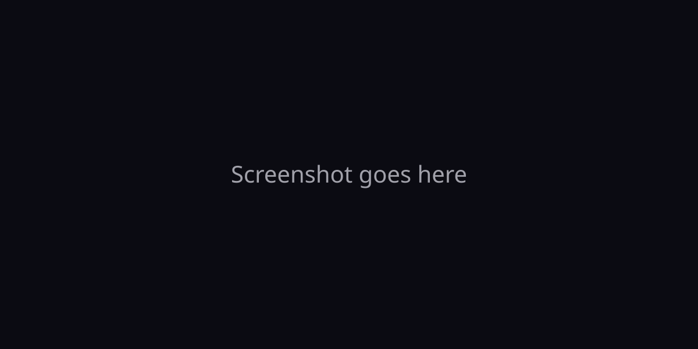
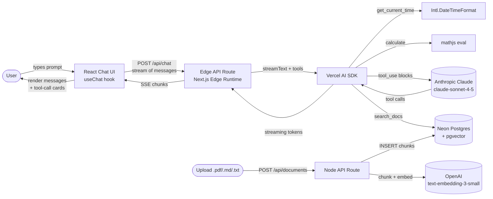

# Foundry Agent Playground

A full-stack agent-building playground that demonstrates streaming chat, tool calling, and RAG — built as a portfolio piece for Microsoft's Foundry Agents Platform.

> 
>
> *Placeholder — replace with an animated GIF or screenshot after first deploy.*

[Live demo](https://foundry-agent-playground.vercel.app) · [Source on GitHub](https://github.com/) · Built by [Henok Mekuria](mailto:henoksmekuria@gmail.com)

## Why I built this

I wanted hands-on intuition for the primitives a modern agent-building platform (Foundry, Vercel AI SDK, OpenAI Assistants) exposes — streaming, tool calls, RAG, and the agent loop — by writing them myself instead of reading abstractions. The result is a single project where the entire path from `useChat()` in React to a pgvector cosine query is legible in roughly 1,500 lines of TypeScript.

It deliberately stops short of being a framework: there are exactly three tools, one model, and one vector store. The point is that every piece is small enough to read in an afternoon.

## Architecture



The chat route runs on the **edge runtime** for low TTFB and native streaming. Uploads run on the **Node runtime** because `pdf-parse` needs `Buffer` + `fs`. Both share the same Neon `@neondatabase/serverless` HTTP driver, which works in either environment.

## Tech stack

| Choice | Why |
| --- | --- |
| **Next.js 14 App Router** | Server components for the page shell, route handlers for the API. App Router's edge runtime support is the cleanest way to stream from a chat endpoint. |
| **Vercel AI SDK (`ai`)** | Standardises tool calling and streaming across providers. The `useChat()` hook handles optimistic updates, stop/reload, and tool-invocation surfacing — replicating it by hand is ~200 lines of code I don't need to maintain. Chose it over LangChain because the abstractions are 10× thinner and the streaming primitives are first-class instead of bolted on. |
| **Anthropic Claude** | `claude-sonnet-4-5` for chat (best-in-class tool use + long context), `claude-haiku-4-5` as the cheap fallback for non-critical tool prompts. |
| **OpenAI `text-embedding-3-small`** | 1536-dim, $0.02 per million tokens, and outperforms `ada-002`. The embedding dimension also matches pgvector's HNSW sweet spot. |
| **Neon Postgres + pgvector** | Chose pgvector over Pinecone for two reasons: (1) the data already lives next to the chunk metadata, so retrieval is one query, not two; (2) Neon's serverless HTTP driver works on the edge runtime, where a `pg`/TCP client would fail. Pinecone is great at scale but overkill below ~1M vectors. |
| **shadcn/ui + Tailwind** | Composable, owned components — no `node_modules` lockup. The tool-call card is custom but every other surface is a thin wrapper over Radix primitives. |
| **`next-themes` + `sonner`** | Dark mode and toast notifications, both ~3 kB and zero-config. |

### Why edge runtime for the chat route

The chat endpoint declares `export const runtime = 'edge'`. The relevant trade-offs:

- **Latency.** Edge functions run on a V8 isolate at the CDN edge, colocated with the user. TTFB on streaming responses drops from ~250–400 ms (single-region Lambda) to ~50–80 ms.
- **No buffering.** Vercel's Node functions buffer up to 4 MB for API Gateway compatibility. Edge functions are pure Fetch — tokens flush to the browser as the model emits them.
- **Cost.** Edge isolates spin up in single-digit ms and bill on CPU time, not invocation memory. For a chat that's mostly waiting on the model, that's noticeably cheaper.

The price is a 1 MB compiled bundle limit, no native Node modules, and HTTP-only DB access. Neon's serverless driver makes that DB constraint a non-issue; the upload route is split off to a Node runtime so we can still use `pdf-parse`.

## Features

### 1. Streaming chat
- `useChat()` hook with optimistic updates, stop, retry, and clear
- Code blocks rendered with `react-syntax-highlighter` (Prism, `oneDark`)
- Empty state with four click-to-fill example prompts

### 2. Tool calling
- Three tools registered with Zod-validated parameters:
  - `search_docs(query)` — semantic search over uploaded docs (RAG)
  - `get_current_time(timezone?)` — IANA-zone-aware current time
  - `calculate(expression)` — safe math eval via `mathjs` with character allowlist
- Each tool call renders as an **expandable card**:
  - Tool icon + name
  - Collapsible arguments (formatted JSON)
  - Collapsible output (custom view for RAG hits, JSON fallback)
  - Pending shimmer while running, then green check + execution time
- `streamText({ ..., maxSteps: 5 })` keeps the model + tools loop streaming inside a single response

### 3. RAG over uploaded documents
- Drag-and-drop `.pdf`, `.md`, `.txt` upload via `react-dropzone`
- Server-side: text extraction (`pdf-parse` for PDFs), char-based chunking (~500 tokens, 50-token overlap, max 200 chunks)
- Embeddings via OpenAI `text-embedding-3-small` (batched, 96 inputs per call)
- Stored in pgvector with an IVFFlat cosine index
- `search_docs` returns top-5 hits with similarity scores; the card displays filename, chunk index, similarity %, and content
- Documents list with one-click delete (cascades to chunks)

### 4. Edge runtime
- `/api/chat` runs at the edge; `/api/documents` (PDF parsing) runs on Node
- Documented at length above and in [`app/api/chat/route.ts`](app/api/chat/route.ts)

### 5. Polish
- Dark mode via `next-themes` (defaults to dark, system-aware)
- Responsive: header collapses labels on mobile, composer scales with viewport
- Skeleton loaders on the documents list, shimmer on pending tool calls
- Toast notifications for every async outcome (`sonner`)
- Inline error card with **Retry** button if the chat API fails
- Custom favicon + OG image (`/public/favicon.svg`, `/public/og.svg`)

## Security & cost protections

| Risk | Mitigation |
| --- | --- |
| Runaway model usage | Token-bucket rate limit (10 req/min/IP, in-memory). Swap for `@upstash/ratelimit` in multi-region. |
| Untrusted file upload | 5 MB max, MIME + extension allowlist, max 200 chunks per doc. |
| Prompt-injected tool args | Per-tool sanitization: query length cap, expression character allowlist, IANA timezone regex. |
| SQL injection | All queries use Neon's tagged-template binding — no string concatenation. |
| Secrets leaking client-side | Only `NEXT_PUBLIC_*` env vars are exposed to the browser. |

## Local setup

```bash
# 1. Install dependencies (Node 20+)
pnpm install   # or: npm install / yarn

# 2. Configure environment
cp .env.example .env.local
# Fill in ANTHROPIC_API_KEY, OPENAI_API_KEY, DATABASE_URL

# 3. Apply the schema
pnpm db:migrate

# 4. Seed sample docs
pnpm db:seed

# 5. Start the dev server
pnpm dev
```

Open [http://localhost:3000](http://localhost:3000) — click an example prompt, watch a tool call fire, ask follow-up questions about the seeded docs.

## Deployment

### Neon Postgres

1. Create a project at [console.neon.tech](https://console.neon.tech).
2. In the dashboard, run the contents of [`db/schema.sql`](db/schema.sql) in the SQL editor (or `pnpm db:migrate` from your laptop pointed at the Neon URL).
3. Copy the **pooled** connection string into `DATABASE_URL`.

### Vercel

1. Push this repo to GitHub.
2. [vercel.com/new](https://vercel.com/new) → import the repo.
3. Add environment variables (`ANTHROPIC_API_KEY`, `OPENAI_API_KEY`, `DATABASE_URL`, `NEXT_PUBLIC_SITE_URL`).
4. Deploy. The first deploy takes ~90 s; subsequent edge-route deploys land in <30 s.

Vercel will automatically use the edge runtime for `/api/chat` because of the `export const runtime = 'edge'` declaration.

## What I learned

- **Edge ≠ "always faster".** Edge buys you TTFB and streaming, but the 1 MB bundle limit forces real engineering discipline. Anything heavier than a small JS library has to be split into a Node route.
- **Tools are mostly schema design.** Claude is genuinely good at filling in well-constrained tools; it gets confused by permissive ones. The 30 minutes I spent tightening Zod schemas paid for itself in fewer retries.
- **`useChat` + `streamText` collapse a lot of complexity.** The Vercel AI SDK isn't just sugar — it owns the tool-use loop, message reconciliation, and SSE plumbing. Reimplementing this in raw `fetch()` would be a couple hundred lines.
- **pgvector is the right default below ~1M vectors.** One query for chunk content + metadata + similarity, no second hop to a vector DB, and the storage layer is the same Postgres you're already running. Pinecone earns its keep at higher scale, not here.

## Project structure

```
app/
  api/chat/route.ts        # Edge runtime, streaming chat + tools
  api/documents/route.ts   # Node runtime, upload + indexing
  api/documents/[id]/route.ts
  layout.tsx               # Theme provider, fonts, metadata
  page.tsx                 # Chat shell
components/
  chat/                    # Chat UI: message list, tool cards, empty state
  documents/               # Upload dialog + document list
  ui/                      # shadcn/ui primitives (Button, Card, Dialog, etc.)
  theme-provider.tsx
  theme-toggle.tsx
lib/
  db.ts                    # Neon serverless client
  embeddings.ts            # OpenAI embeddings + pgvector formatting
  chunk.ts                 # Char-based text chunker
  tools.ts                 # 3 Vercel AI SDK tools
  rate-limit.ts            # In-memory token bucket
  sanitize.ts              # Tool-arg sanitization
  utils.ts                 # cn(), formatMs(), truncate()
db/
  schema.sql               # pgvector + documents + chunks tables
scripts/
  migrate.ts               # Apply schema to $DATABASE_URL
  seed.ts                  # Embed + insert 3 sample docs
  sample-docs/             # 3 markdown files used by the seed
```

## License

MIT. See [LICENSE](LICENSE).
